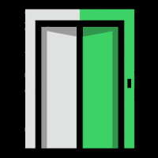

# Severence: Secure SPARQL Service

A highly secure, very lightweight, query system

## Severed for Security: Your Queries Stay Innie

**Query Flow Diagram**

**Interoperability and Security Features:**
1. Requires Registry Hub authorization token
2. Queries are named and pre-approved, not arbitrary
3. Follows Web standards for queued processes
4. External and Internal components are fully independent (containers); internal can be switched off and external will continue to queue (no lost requests)
5. No external connection to the secure area→ Inside to Outside only
6. Impossible to DoS the Internal component - queue is accessed one-query-at-a-time
7. Data in the “intermediate store” is immediately encrypted upon arrival  (in principle, it could be sent encrypted, if we ensure both sides share an encryption key)
8. Data is decrypted and deleted as soon as it is called by the user - no second chances, but also lower risk
9. Code content of the Docker Containers is minimal - very low profile for security risks.
10. Containers both run as unprivileged users
11. Current codebase allows both CSV and JSON responses... but i don't think the user will ever want to receive JSON SPARQL results, so we probably only want to use CSV.  even automated access will be harder to deal with using json, IMO.  We could create a small parser in the External component that translates CSV into an equivalent JSON, if that's useful.

**Possible Attacks?**
1. Modify queries - high impatct attack.  Likelihood?  Attacker needs to either a) secretly change the query in the GitHub so that a corrupted query is pulled by the Inside.  b) the Inside needs to forget to vet the queries they pull from GitHub (since this is voluntary and manual!) or c) the attacker is already inside the protected space and has file-level access to modify the query - in that case, there are bigger problems!  Most likely attacker profile for all of these is a rogue employee
2. Modification of Docker Image - high-impact attack.  Similar risk profile as above.
3. All other attacks I can imagine already require the attacker to be inside of the Secure Zone, which is already at the highest level of impact regardless of our software.
